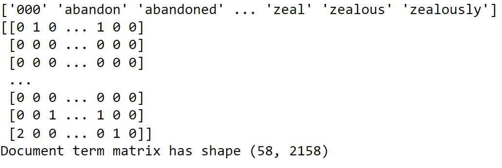

## What it is?
* Represents the documents as vectors and tokens as features.
* Evaluate the frequency of the tokens within each document.
* The most commonly used variation of DTM is the logarithmic one:
	* All the values in the matrix are calculated as: $1 + log(tf_{w,d})$

## Why is it Useful?
* To calculate these Metrics:
	* Term Frequency: $tf_{w, d}$ -> Occurences of word $w$ in document $d$
	* Document Frequency: $df_{w}$ -> Number of documents containing word $w$
	* Collection Frequency: $cf_{w}$ -> Occurences of word $w$ in all documents.

### Example
```
# Use the sklearn feature extractor CountVectorizer
from sklearn.feature_extraction.text import CountVectorizer

# CountVectorizer: -> Stop Words English and min_df (minimum df of 5)
vectorizer = CountVectorizer(min_df=5, stop_words='english')

# Create the dtm
dtm = vectorizer.fit_transform(speeches)

# Generate the Vocab -> BoW
vocab = vectorizer.get_feature_names_out()
```




 