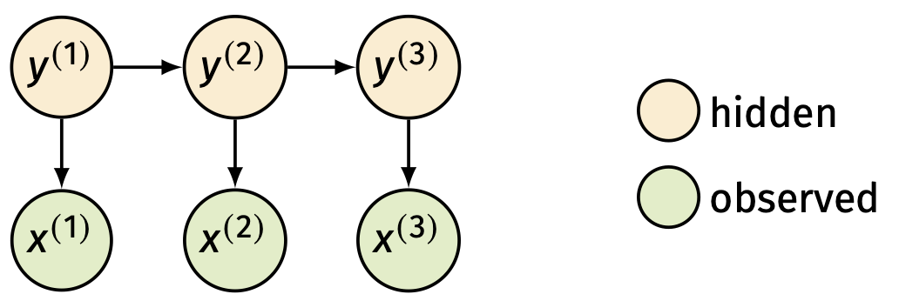
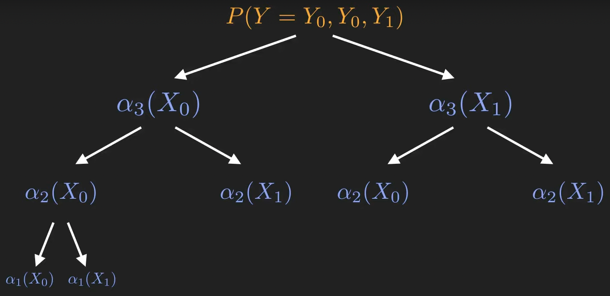

## Markov Chains
* It's a discrete, finite and memory-less process where the next state only depends on the previous state. Which means that the probability of transitioning from the state ($t-1$) to the state ($t$) only depends on the state ($t-1$) and not the previous states.
* In a sequence of events $s_{1}, s_{2},...,s_{t}$ if we want to know the probability of the final event, we have to consider the conditional probability of the event $s_{t}$ happening given the previous events $s_{1},s_{2},...,s_{t-1}$. 
* Therefore, with the Markov Chain rule: $P(s_{t}|s_{t-1},s_{t-2},...,s_{1}) = P(s_{t}|s_{t-1})$. 
* And the probability of the entire sequence of events:  $P(s_{1}, s_{2},...,s_{t})$ considering the Markov Chain rule can be formulated as follows: $$P(s_{1}, s_{2},...,s_{t}) = \prod_{i=1}^{t} P(s_{i}|s_{i-1})$$ 
## Hidden Markov Models
* It's a **generative probabilistic** model that relies on 2 concepts:
	* **Hidden States** that follow a Markov Chain: $y_{0} \rightarrow y_{1} \rightarrow y_{2},..., \rightarrow y_{t}$
	* **Observables** the are generated from the hidden states.
	* **The Join probability** of observables and hidden states: $$P(x_{1},x_{2},...,x_{n}\,,\,y_{1},y_{2},...,y_{n},) = P(x_{1},x_{2},...,x_{n}\,|\,y_{1},y_{2},...,y_{n},)$$
* **Rules**
	* The Observables only depend on the current state. 
	* We a priori assume that the states are unknown. 
	* The probabilities between hidden states and observables are **static**. No matter the time in the sequence $t$.
* The HHM can be also expressed as a tuple $\lambda = (Y, X, A, B, \pi)$.

### Matrices for the Hidden Markov Model
* To determine the set of probabilities that we will be using to calculate the sequence of observable events we need two matrices:
	* **Transition Matrix, A** : The probabilities to transition from state $s_{t}$ to $s_{t+1}$.
		* $P(s_{t}) = y_{j}$, $P(s_{t+1}) = y_{i}$. Therefore, $P(s_{t+1}|s_{t}) = a_{ij}$. 
	* **Emission Matrix, B**: The probabilities of the observables at the current state $s_{t}$.
		* $P(x|s_{t}) = b_{ij}$.
	* **Stationary Vector, $\pi$**: Contains the probabilities of the states at $t = 0$. The stationary vector is obtained calculating the eigenvalues of the Transition matrix: $\pi A = \pi$.

## Three types of problems to be solved

### Evaluation Problem
* What is the probability for a specific sequence of observables $P(x_{1},x_{2},...x_{n})$. We know that each observation depends on the current state $x_{i}|y_{i}$, and the next state depends on the current state $y_{i+1}|y_{i}$.
* $P(X=x_{1},x_{2},...,x_{n}) = P(y_{1}) \cdot P(x_{1}|y_{1}) \cdot P(y_{2}|y_{1}) \cdot P(x_{2}|y_{2}) \cdot P(y_{3}|y_{2}) \cdot P(x_{3}|y_{3}) ...$
* Therefore, $P(X=x_{1}, x_{2},...,x_{n})$ is the sum of all possible combinations of hidden states over the length of the sequence: $|Y|^T$. $|Y|$ being the number of hidden states and $T$ the length of the sequence.$$P(X=x_{1},x_{2},...,x_{n}) = \sum_{i} \left( \prod_{i} P(y_{i+1}|y_{i}) \prod_{i} P(x_{i}|y_{i}) \right)$$
### Solve the Evaluation Problem using Forward Algorithm
* The naive approach for the evaluation problem, summing up all the possible combinations of the probabilities leading to a specific sequence of observations, has an exponential run time complexity ($|Y|^T$). Which means is very unlikely to be used in real word problems.
* A more intelligent way to do the computations is by using **recurrence relation** and **dynamic programming**. Meaning, finding patterns that repeat themselves and used them for future calculations. 

### Example
* Let's imagine we want to know the probability of having a sequence of observations: $y_{0}, y_{0}, y_{1}$and we know that there are two states $X_{0}, X_{1}$ responsible for it. We can compute a dynamic tree from $P(y_{0}, y_{0}, y_{1})$, to $P(y_{0}, y_{0})$, to $P(y_{0})$. The tree is computed in a forward fashion from higher to lower combinations.

* $\alpha_{3}(X_{0})$: is the probability of 3 possible combinations ending with the state $X_{0}$ and yielding the observation $y_{1}$.
* $\alpha_{3}(X_{1})$:is the probability of 3 possible combinations ending with the state $X_{1}$ and yielding the observation $y_{1}$.
* $P(Y=y_{0},y_{0},y_{1}) = \alpha_{3}(X_{0}) + \alpha_{3}(X_{1})$.
* $\alpha_{2}(X_{0})$: is the probability of 2 possible states ending with $X_{0}$.
* $\alpha_{2}(X_{1})$: is the probability of 2 possible states ending with $X_{1}$.
* $\alpha_{3}(X_{0})$ can be expressed in terms of $\alpha_{2}(X_{0})$ and $\alpha_{2}(X_{1})$: $$\alpha_{3}(X_{0}) = \alpha_{2}(X_{0}) \cdot P(X_{0}|X_{0}) \cdot P(y_{1}|X_{0}) + \alpha_{2}(X_{1}) \cdot P(X_{0}|X_{1}) \cdot P(y_{1}|X_{0})$$
* $\alpha_{1}(X_{0})$: is the probability of starting with the state $X_{0}$ and yielding the first observation $y_{0}$. Therefore, $\alpha_{1}(X_{0}) = P(X_{0}) \cdot P(y_{0}|X_{0})$.
* $\alpha_{1}(X_{1})$:is the probability of starting with the state $X_{1}$ and yielding the first observation $y_{0}$. Therefore, $\alpha_{1}(X_{1}) = P(X_{1}) \cdot P(y_{0}|X_{1})$.
* $\alpha_{2}(X_{0})$ can be expressed in terms of $\alpha_{1}(X_{0})$ and $\alpha_{1}(X_{1})$: $$\begin{align}\alpha_{2}(X_{0}) = \alpha_{1}(X_{0}) \cdot P(X_{0}|X_{0}) \cdot P(y_{0}|X_{0}) + \alpha_{1}(X_{1}) \cdot P(X_{0}|X_{1}) \cdot P(y_{0}|X_{0}) \\[.2cm] \alpha_{2}(X_{0}) = P(X_{0}) \cdot P(y_{0}|X_{0}) \cdot P(X_{0}|X_{0}) \cdot P(y_{0}|X_{0}) + P(X_{1}) \cdot P(y_{0}|X_{1}) \cdot P(X_{0}|X_{1}) \cdot P(y_{0}|X_{0})\end{align}$$
* We finally recompute all the terms from $\alpha_{1}$, to $\alpha_{2}$ till $\alpha_{3}$ and get the total probability for the sequence: $y_{0}, y_{0}, y_{1}$.

### Formal Notation
* The $\alpha_{t}$'s are computed in this way: $$\alpha_{t}(X_{i}) = \sum_{j=0}^{n-1} \alpha_{t-1}(X_{j}) \cdot P(X_{i}|X_{j}) \cdot P(y^{t}|X_{i})$$
* The base forms ($\alpha_{1}$) are computed in this form: $$\alpha_{1}(X_{i}) = \pi(X_{i}) \cdot P(y^{1}|X_{i})$$
* The probability of the whole sequence is given by: $$P(y^{0}, y^{1},...,y^{t}) = \sum_{i=0}^{n-1} \alpha_{t-1}(X_{i})$$
### Decoding Problem
* [[Viterbi Algorithm]]
