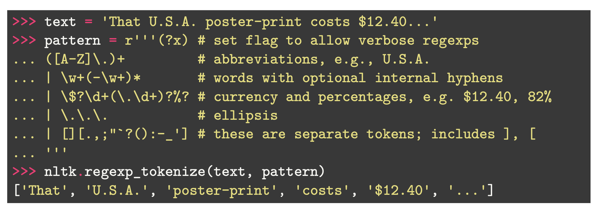

# What is it?
* Includes all the steps required to Normalize and Tokenize the text before feeding it to an ML model.
* **Text Normalization** inlcudes the following steps:
	* Lower case transformation
	* Segmenting sentences
	* Tokenization
	* Punctuation removal
	* Normalization
	* Denoising, or stopword removal

## Tokenization
* Tokenization is the process of breaking up / splitting a document into small pieces called tokens. Generally, at word level but could also include interpunctuation.
* Breaking large sentences into tokens helps in [[Text Vectorization]].
* Understand the meaning of a document through the analysis of the tokens

### Best way to tokenize
* Using regex: ``` [:.?!]\s ``` 
* Splitting by space characters: ``` \s, \w+ ```
```
# Define a splitting patter with regex code
pattern = '[.:,;?!]\s\n'

# Use re.split to split each line of the document into tokens
for line in gzip.open("/data/datasets/shakespeare-hamlet.txt.gz", "rt"):
	token_list = re.split(pattern, line)
```

**Other Example**:


## Normalisation
Transform all words in their infinite form, get rid of all conjugations.
Two processes are generally used:

### Stemming
* Stemming is the operation of removing all **inflections/grammatical affixes** of a word. 
* Popular stemmer algorithm: **Porter**.
* ***stem*** is the core meaning of a word, then there is affixes added on top.
**Example**:
```
import nltk
from nltk.stem import PorterStemmer
word_stemmer = PorterStemmer()
word_stemmer.stem('writing')
```
Output would be **write**.

### Lemmatization
* Alternative to Stemming, instead of cutting off the inflections, use the **morphological base form** of a word. 
* Lemmatizers rely on dictionaries to transform words to their morphological base form.
 * ***Lemma** -> Morphological base form
```
lemmatizer = WordNetLemmatizer()
# Lemmatization
for i in range(len(sentences)):
    words = nltk.word_tokenize(sentences[i])
    words = [lemmatizer.lemmatize(word) for word in words if word not in set(stopwords.words('english'))]
```

### Denoising / Stopword removal
* Denoising is the act of removing stopwords from the text.
* Stopwords have a high frequency -> but convey little to no meaning.

## Preprocessing Order

1. Lowercase transformation
2. Remove punctuation
3. Remove numbers
4. Remove stopwords
5. Tokenize
6. Normalize the text. (lemmatize).

