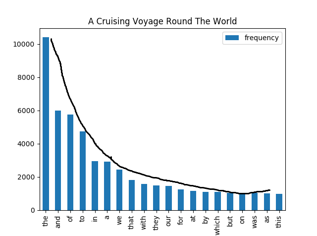
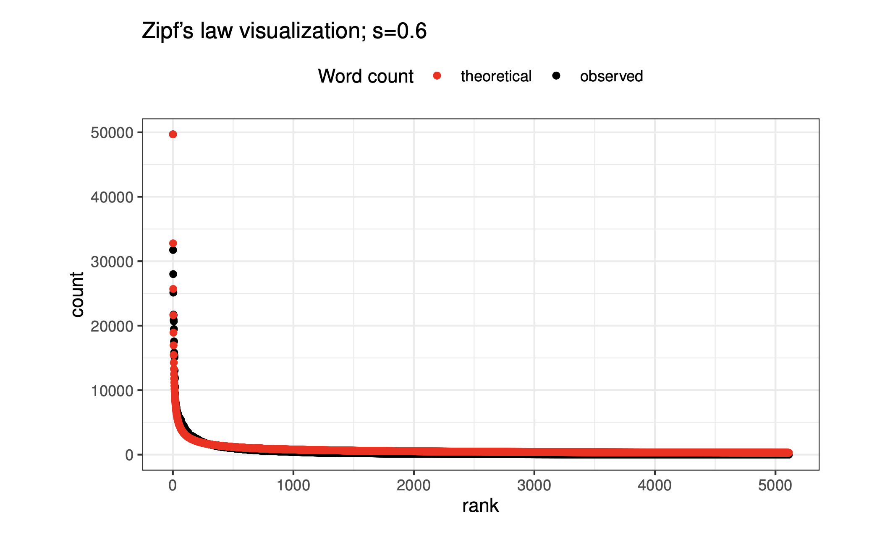

## What is it?
* Aims to statistically model the distribution of words in a corpus.
* The distribution of words in a corpus is totally different from a **Normal Distribution**.

## The Law says
* **The frequency of a word is inversely proportional to its frequency rank.**

### The formula for the Law
$$ r \cdot freq(word) = A \cdot N $$
* $r$: The rank of the word based on the frequency
* $freq$: The frequency of the word
* $A$: A general constant 
* $N$: The total number of words

**Example**

